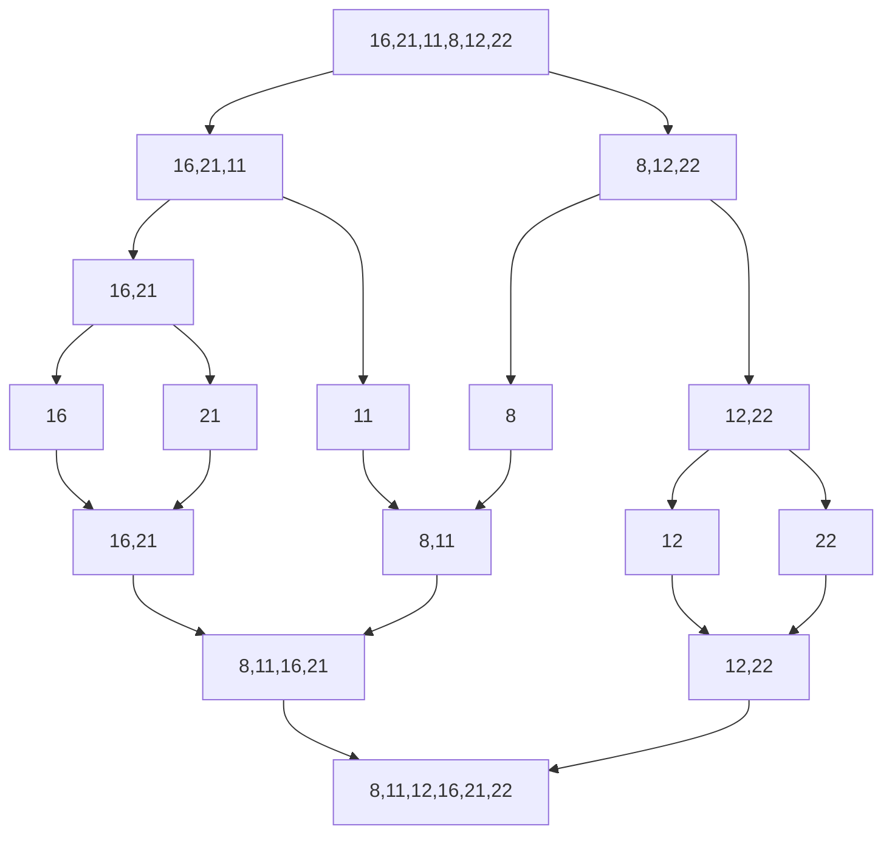

  #  Proje 2

**[16,21,11,8,12,22] -> Merge Sort**

* **Yukarıdaki dizinin sort türüne göre aşamalarını yazınız.**
* **Big-O gösterimini yazınız.**

------------------

*Başlangıçta dizimizi tek eleman kalana kadar ikiye bölüyoruz. Sonrasında karşılaştırma yöntemini kullanarak sıralayarak birleştiriyoruz*

Big-O notation: O(n * log n)
